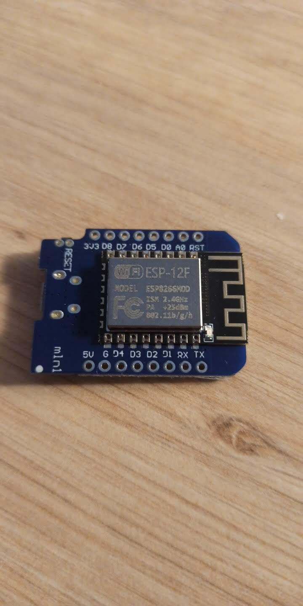
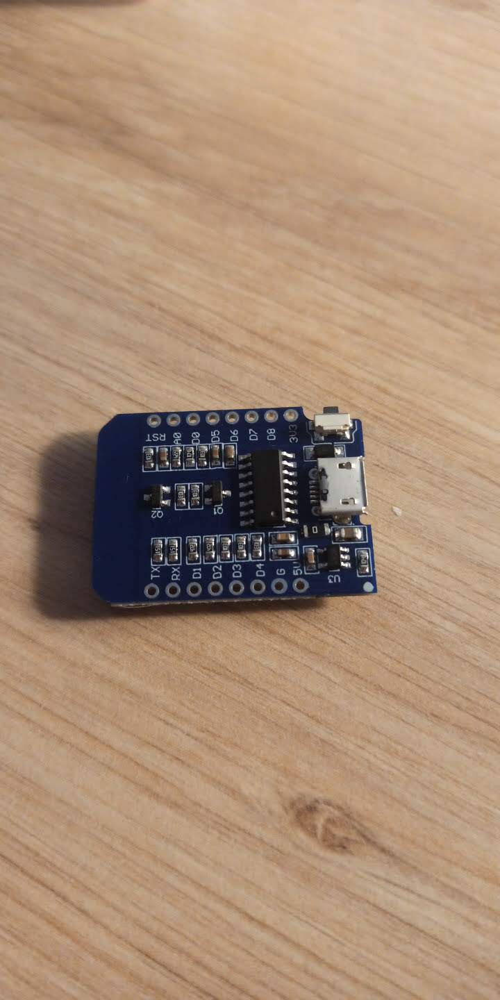

# Card_diplay
Creation of a simple but cool card display !

**/!\ DISCLAIMER : This repository is a way for me to share my project, it is not a complete tutorial. Some errors may have slip in it.**

Materials : 
- electrical wires
- Woden plank (plywood 5mm)
- ESP8266 (ESP-12F)
- LED strip

Thus I do not recommand the ESP8266 (ESP-12F) I found it difficult to manage the different pin since they have specific purpose. Any microcontroler (with PWM pins) should work

Code : I used Claude AI to help me.

Manual : 
There are two buttons, mode and choice. The first one make it possible to change mode between off, colours and animations. The second one is used to choose wich color or animation you want. (See the video for further demonstration.

[Watch video](./Video_colors.mp4)
[Watch video](./Video_animations.mp4)
